# Internet of Things
## Introduction

---

## Course Information
* 11 Hours of class
* Theory
* Practical
    * Contiki project (6 weeks after last class)  

---

## Internet of Things

* It is a concept that has attracted much rhetoric, misconception and confusion as to what it means and its implications in a social context

* First proposed by [MIT Auto-ID Center](http://autoidlabs.org/) and intimately linked to [RFID](http://en.wikipedia.org/wiki/Radio-frequency_identification) and electronic product code ([EPC](http://www.gs1.org/barcodes))

* <em>... all about physical items talking to each other...</em>

---

## Internet of Things

* Refers to a network between objects, usually it  will be wireless and self-configuring, such as household appliances. <!-- .element: class="fragment" -->

* Has come to describe a number of technologies and research disciplines that enable the Internet to reach out into the real world of physical objects. <!-- .element: class="fragment" -->

---

## Dimensions
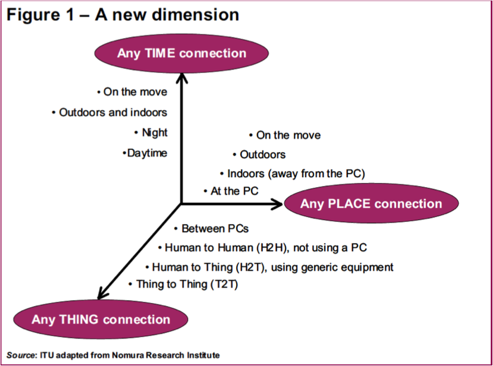 <!-- .element: class="stretch" -->

---

## Why?

* Dynamic control of industry and daily life
* Improve the resource utilization ratio 
* Better relationship between human and nature
* Act as a technology integrator

---

## Enabling technologies

* `RFID`: To identify and track the data of things 

* `Sensors`: To collect and process the data to detect the changes in the physical status of things

* `Networks`: To enhance the power of the network by transferring processing capabilities to different part of the network.

* `Nano Tech`: To make the smaller and smaller things have the ability to connect and interact.

---

### Applications. Intelligent Home
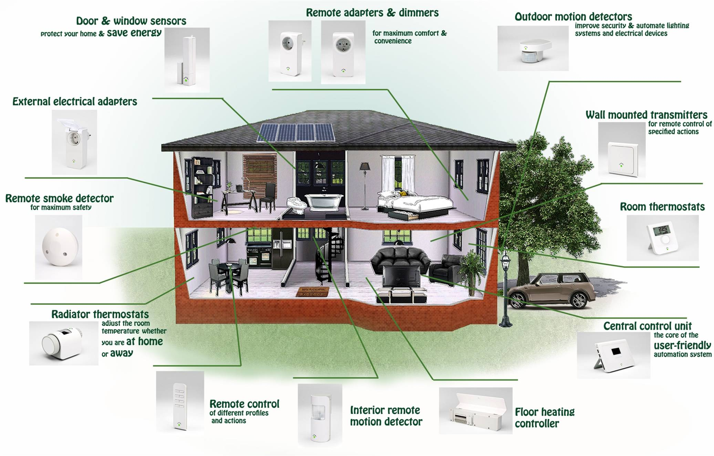

---

### Applications. Intelligent Home 2
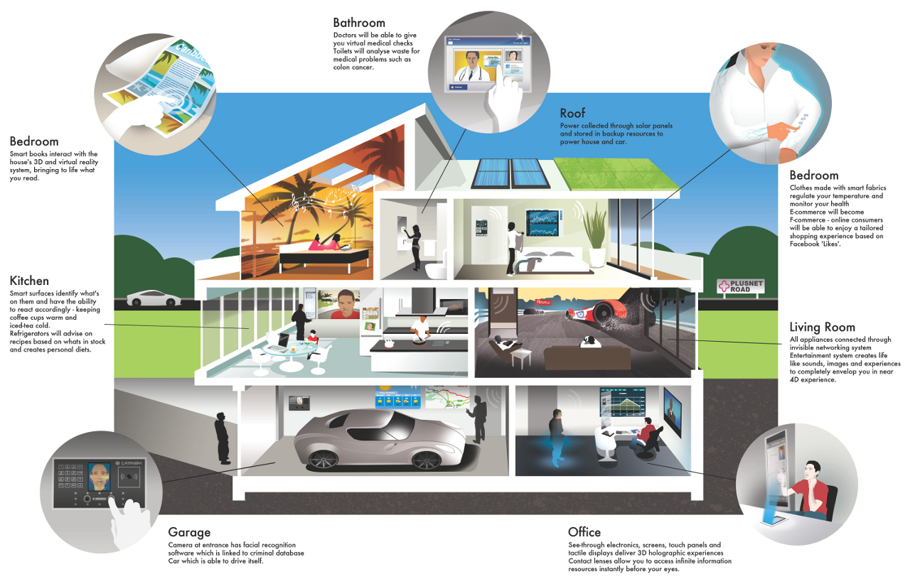

---

### Applications. Smart Grid
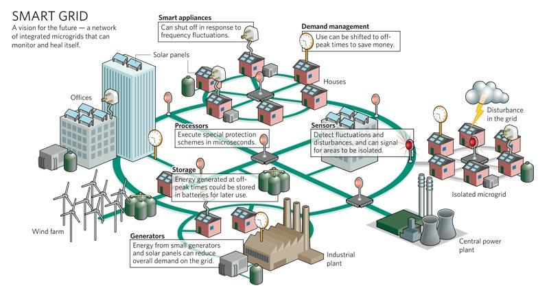

---

### Applications. Shopping
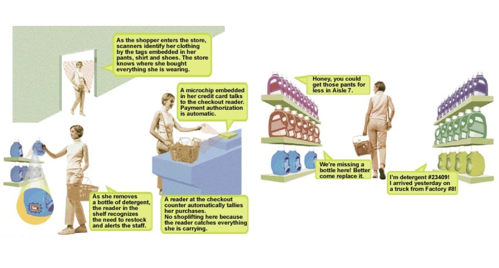

---

### Applications. Health care
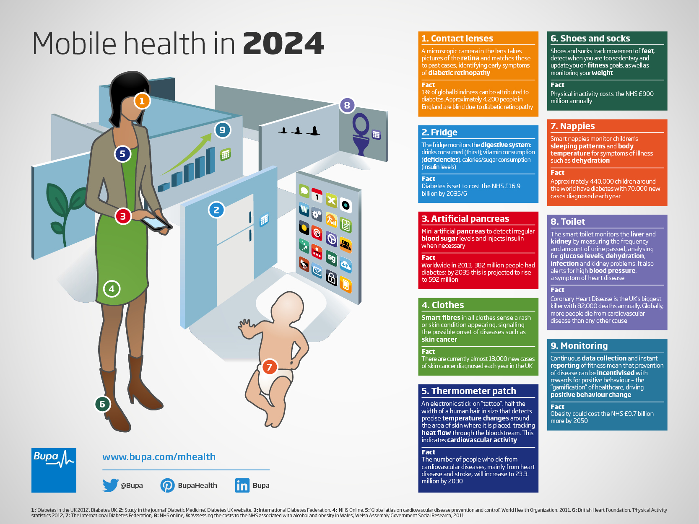

---

### Applications. Transportation
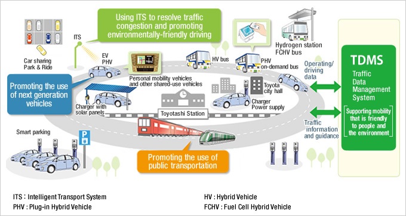

---

### Applications. Manufacturing
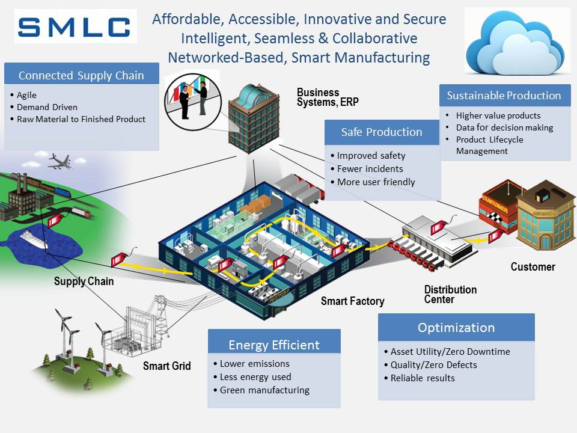

---

### Applications. Farming
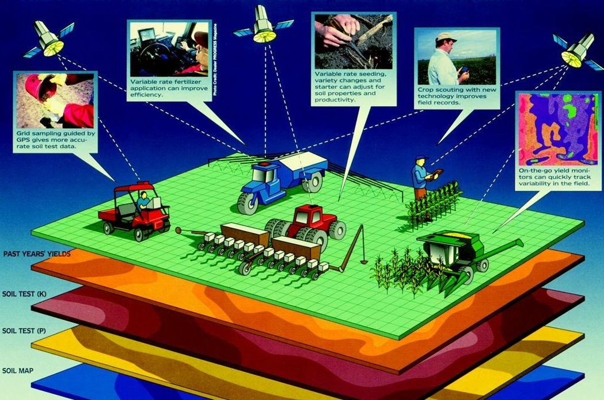

---

### Applications. Logistics
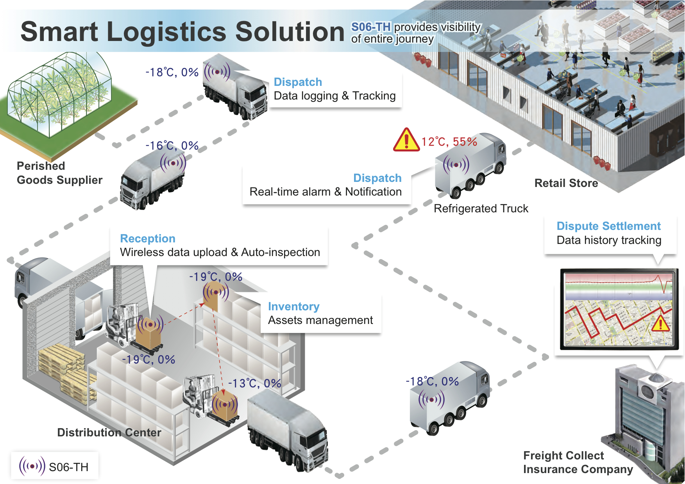

---

## State of the Art
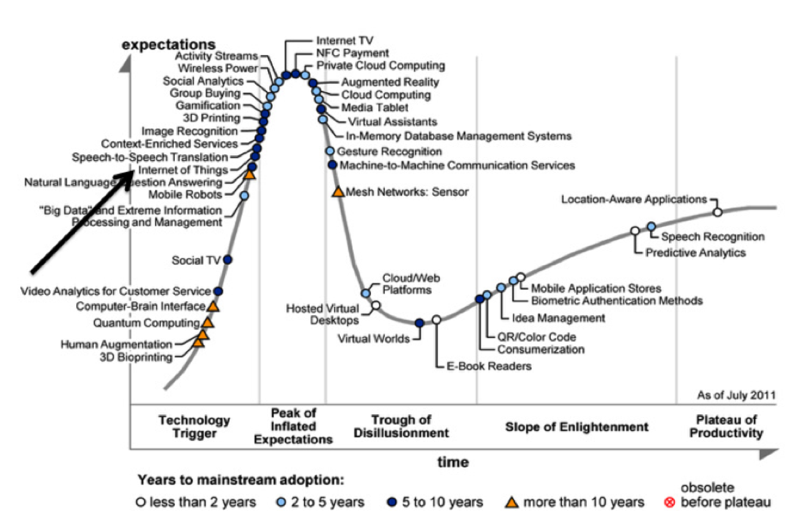

---

## Challenges

- Technological Standardization in most areas are still remain fragmented.
- Managing and fostering rapid innovation is a challenge for governments 
- Privacy and security
- Absence of governance

---

## Examples
The tado° smart thermostat and intelligent heating system

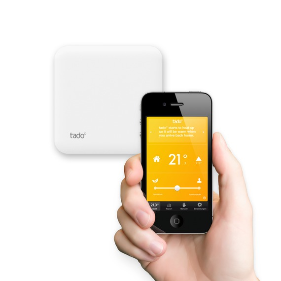

---

## Examples
The LIFX WiFi light bulb

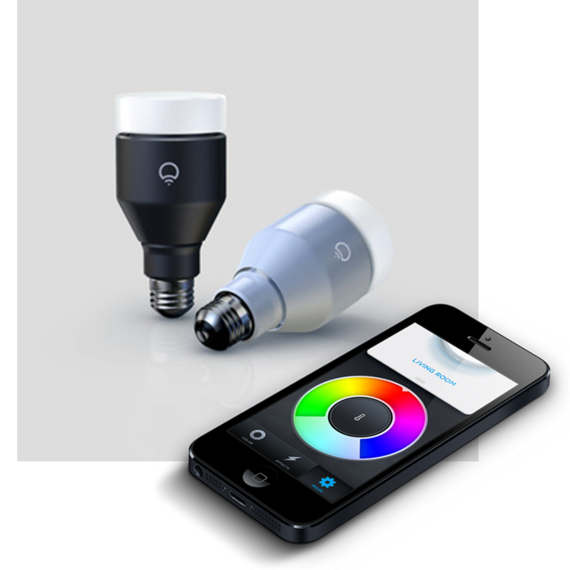

---

## Examples
Watteco IP Sensors

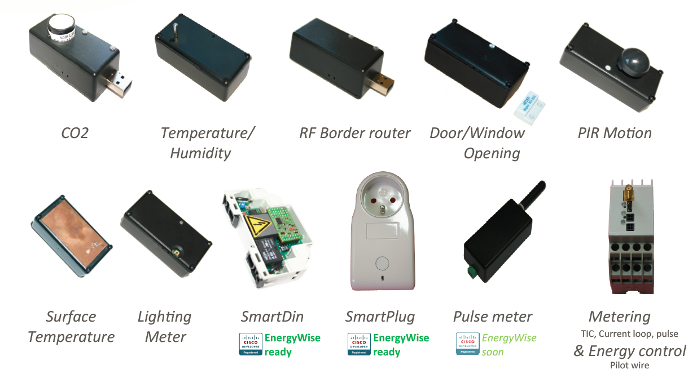

---

## Examples
Zolertia Zoundtracker. Noise monitoring system

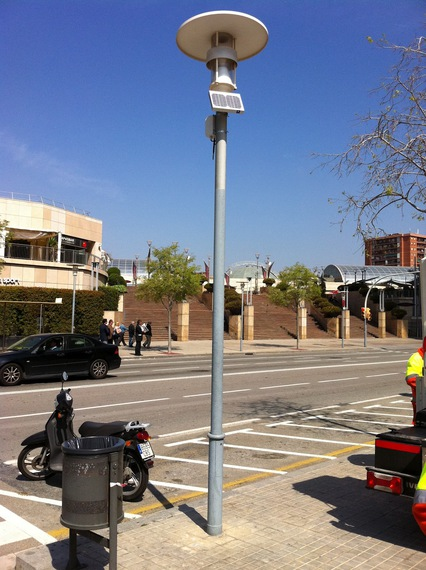

---

### Some inspiration...

<a href="http://www.youtube.com/watch?feature=player_embedded&v=ozLaklIFWUI
" target="_blank"></a>

---

# Contiki

#### An Operating System 
#### for the Internet of things

---

## Installation

- Download [Instant Contiki](http://sourceforge.net/projects/contiki/files/Instant%20Contiki/)
- Download [Virtual Box](http://www.vmware.com/go/downloadplayer/)
- Follow [this](http://www.contiki-os.org/start.html) instructions

---

## Setup suggestions

* Spanish keyboard 
    * System Settings > Keyboard Layout > Layouts > Spanish

* Install your favourite editor
```
apt get install vim
```
```
apt get install eclipse
```
```
sudo add-apt-repository ppa:webupd8team/sublime-text-3
sudo apt-get update
sudo apt-get install sublime-text-installer
```

* Add include directories to Eclipse
    * /usr/local/avr/include
    * /home/user/CodeSourcery/SourceryG++Lite/arm-none-eabi/include

---

## Contiki

- Contiki – pioneering open source operating
system for sensor networks
    - <u>IP networking</u>
    - Hybrid threading model, <u>protothreads</u>
    - Dynamic loading
    - Power profiling
    - Network shell
- Small memory footprint
- Designed for portability
    - 14 platforms, 5 CPUs

---

## Name

The [Kon-Tiki raft](http://en.wikipedia.org/wiki/Kon-Tiki) sailed across the Pacific Ocean with minimal resources


---

## Targets

- Small embedded processors with
networking
    - Sensor networks, <b>smart objects</b> ...
- 98% of all microprocessors go into
embedded systems
- 50% of all processors are 8-bit
    - MSP430, AVR, ARM7, 6502, ...

---

## Background: uIP

- uIP – micro IP
- Open source
- ~5k code, ~2k RAM
    - Smallest configuration ~3k code, ~128 bytes
RAM
- RFC compliant
    - Order of magnitude smaller than previous stacks
- Bottom-up design
    - Single-packet buffer
    - <u>Event-driven</u> API

---

## uIP: API

- Two APIs
    - The “raw” uIP event-driven API
    - Protosockets, sockets-like programming based on protothreads

- Event-driven API works well for small programs
    - Explicit state machines

- Protosockets work better for larger programs
    - Sequential code

---

## uIP Example

```c
int smtp_protothread(struct psock *s)
{
    PSOCK_BEGIN(s);
    PSOCK_READTO(s, '\n');
    if(strncmp(inputbuffer, “220”, 3) != 0) {
    PSOCK_CLOSE(s);
    PSOCK_EXIT(s);
}

PSOCK_SEND(s, "HELO ", 5);
PSOCK_SEND(s, hostname, strlen(hostname));
PSOCK_SEND(s, "\r\n", 2);
PSOCK_READTO(s, '\n');
if(inputbuffer[0] != '2') {
    PSOCK_CLOSE(s);
    PSOCK_EXIT(s);
}
```

note: Not sure if this is needed

---

## Processes

* The Contiki kernel is event-based
    * Invokes processes whenever something
happens
        * Sensor events
        * Processes starting, exiting
* Process invocations must not block
* Protothreads provide sequential flow of
control in Contiki processes

[More info](https://github.com/contiki-os/contiki/wiki/Processes)

---

## Hello World

```
/* Declare the process */
PROCESS(hello_world_process, "Hello world");
/* Make the process start when the module is loaded */
AUTOSTART_PROCESSES(&hello_world);

/* Define the process code */
PROCESS_THREAD(hello_world_process, ev, data) {
    PROCESS_BEGIN(); /* Must always come first */
    
    printf("Hello, world!\n"); /* Initialization code goes here */
    while(1) { /* Loop for ever */
        PROCESS_WAIT_EVENT(); /* Wait for something to happen */
    }
    
    PROCESS_END(); /* Must always come last */
}
```

---

## Processes API

```
PROCESS_BEGIN();            // Declares the beginning of a process' protothread.

PROCESS_END();              // Declares the end of a process' protothread. 

PROCESS_EXIT();             // Exit the process. 

PROCESS_WAIT_EVENT();       // Wait for any event. 

PROCESS_WAIT_EVENT_UNTIL(); // Wait for an event, but with a condition.

PROCESS_YIELD();            // Wait for any event, equivalent to PROCESS_WAIT_EVENT().

PROCESS_WAIT_UNTIL();       // Wait for a given condition; may not yield the process.

PROCESS_PAUSE();            // Temporarily yield the process.
```

---

## Sending events to processes

```
static char msg[] = "Data";
 
 static void
 example_function(void)
 {
   /* Start "Example process", and send it a NULL
      pointer. */
 
   process_start(&example_process, NULL);
  
   /* Send the PROCESS_EVENT_MSG event synchronously to
      "Example process", with a pointer to the message in the
      array 'msg'. */
   process_post_synch(&example_process,
                      PROCESS_EVENT_CONTINUE, msg);
   /* Send the PROCESS_EVENT_MSG event asynchronously to 
      "Example process", with a pointer to the message in the
      array 'msg'. */
   process_post(&example_process,
                PROCESS_EVENT_CONTINUE, msg);
 
   /* Poll "Example process". */
   process_poll(&example_process);
 }

```

---

## Event driven

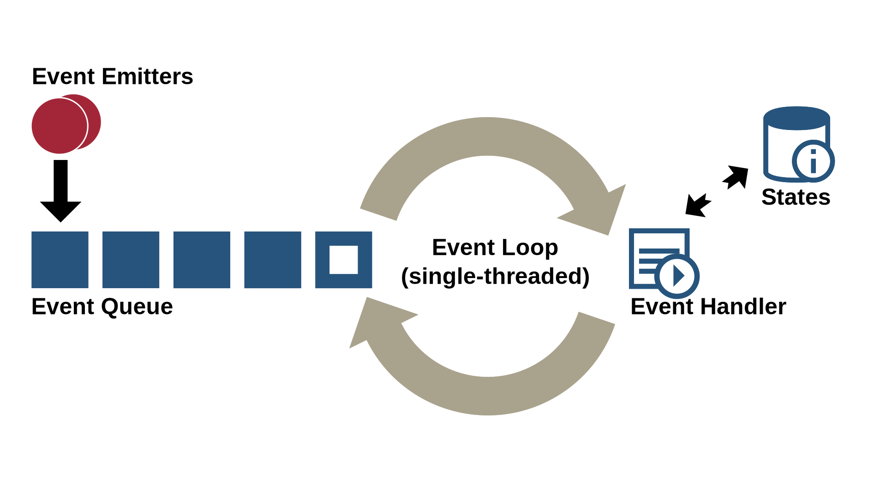

---

## Event driven

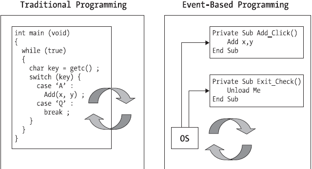

---

## Event-driven vs multithreaded

 

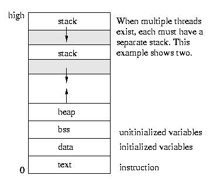 <!-- .element: class="fragment" -->

* Multithreading requires per-thread stacks <!-- .element: class="fragment" -->
* Event-driven requires less memory <!-- .element: class="fragment" -->

---

## Why not to use threads

* Threads require stack memory
    * Unused stack space wastes memory
    * 200 bytes out of 2048 bytes is a lot!
* A multi-threading library quite difficult to port
    * Requires use of assembly language
    * Hardware specific
    * Platform specific
    * Compiler specific

---

### Protothreads: 
#### A new programming abstraction
* A design point between events and threads
* Programming primitive: conditional blocking wait
```
PT_WAIT_UNTIL(condition)
```
* Single stack
    * Low memory usage, just like events
* Sequential flow of control
    * No explicit state machine, just like threads
    * Programming language helps us: if and while

---

### Protothread example

```
int a_protothread(struct pt *pt) {
    PT_BEGIN(pt);
    ...
    PT_WAIT_UNTIL(pt, condition1);
    ...
    if(something) {
        PT_WAIT_UNTIL(pt, condition2);
        ...
    }
    ...
    PT_END(pt);
}
```

---

### Protothread limitations

* Automatic variables not stored across a blocking
wait

    ``` 
    void f(struct pt *pt) {
        int a=1;
        ...
        PT_WAIT_UNTIL(pt, condition);
        printf("%d\n",a);
        ...
    }
    ```

    * Compiler does produce a warning
    * Workaround: use static local variables instead

    ``` 
    void f() {
        static int a=1;
        ...
        PT_WAIT_UNTIL(pt, condition);
        printf("%d\n",a);
        ...
    }
    ```

* Constraints on the use of switch() constructs in
programs
    * No warning produced by the compiler
    * Workaround: don’t use switches

---

## Timers
* struct timer
    * Passive timer, only keeps track of its expiration time

* struct etimer
    * Active timer, sends an event when it expires

* struct ctimer
    * Active timer, calls a function when it expires
    * Used by Rime

* struct rtimer
    * Real-time timer, calls a function at an exact time
    * Be careful ***only 1 rtimer per mote will work!***

[More info](https://github.com/contiki-os/contiki/wiki/Timers)

[And still more](http://anrg.usc.edu/contiki/index.php/Timers)

---

## Etimer

```
PROCESS_THREAD(hello_world_process, ev, data) {
    static struct etimer et; /* Must be static */
    PROCESS_BEGIN();    /* since processes are */
                        /* protothreads */
    while(1) {
        /* Using a struct timer would not work, since
        the process would not be invoked when it expires. */
        etimer_set(&et, CLOCK_SECOND);
        
        PROCESS_WAIT_EVENT_UNTIL(etimer_expired(&et));
        
        /* One second has passed :) */
    }
    
    PROCESS_END();
}
```

---

## Networking

RIME vs IP

---

## RIME

* A set of communication abstractions (in increasing complexity):
    * Single-hop broadcast (broadcast)
    * Single-hop unicast (unicast)
    * Reliable single-hop unicast (runicast)
    * Best-effort multi-hop unicast (multihop)
    * Hop-by-hop reliable multi-hop unicast (rmh)
    * Best-effort multi-hop flooding (netflood)
    * Reliable multi-hop flooding (trickle)

---

## RIME

* A set of communication abstractions (continued)
    * Hop-by-hop reliable data collection tree routing (collect)
    * Hop-by-hop reliable mesh routing (mesh)
    * Best-effort route discovery (route-disovery) 
    * Single-hop reliable bulk transfer (rudolph0)
    * Multi-hop reliable bulk transfer (rudolph1)

---

## RIME

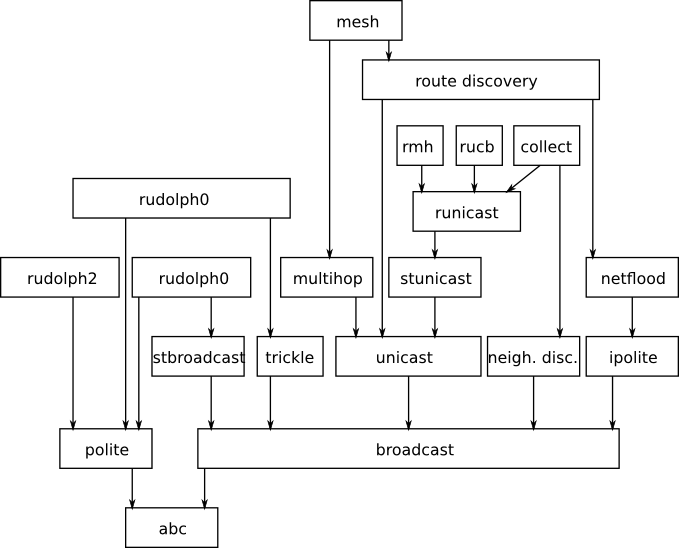

---

## RIME: Detailed primitives

* <u>abc:</u> the anonymous broadcast, it justs sends a packet via the radio driver, receives all packet from the radio driver and passes them to the upper layer;

* <u>broadcast:</u> the identified broadcast, it adds the sender address to the outgoing packet and passes it to the abc module;

* <u>unicast:</u> this module adds a destination address to the packets passed to the broadcast block. On the receive side, if the packet's destination address doesn't match the node's address, the packet is discarded;

---

## RIME: Detailed primitives
* <u>stunicast:</u> the stubborn unicast, when asked to send a packet to a node, it sends it repeatedly with a given time period until asked to stop. This module is usually not used as is, but is used by the next one;

* <u>runicast:</u> the reliable unicast, it sends a packet using the stunicast module waiting for an acknowledgment packet. When it is received it stops the continuous transmission of the packet. A maximum retransmission number must be specified, in order to avoid infinite sending;


---

## RIME: Detailed primitives

* <u>polite and ipolite:</u> these two modules are almost identical, when a packet has to be sent in a given time frame, the module waits for half of the time, checking if it has received the same packet it's about to send. If it has, the packet is not sent, otherwise it sends the packet. This is useful for flooding techniques to avoid unnecessary retransmissions;

* <u>multihop:</u> this module requires a route table function, and when about to send a packet it asks the route table for the next hop and sends the packet to it using unicast. When it receives a packet, if the node is the destination then the packet is passed to the upper layer, otherwise it asks again the route table for the next hop and relays the packet to it;

---

## RIME Channels

* All communication in Rime is identified by a 16-bit channel
    * Communicating nodes must agree on what modules to use on a certain channel
        * Unicast on channel 155
        * Netflood on channel 130
    * Channel numbers lower than 128 are reserved by the system. Used by the shell, other system apps

---

#### Example 1. Send to Neighbours

```
void recv(struct broadcast_conn *c) {
    printf("Message received %s\n", (char*)packetbuf_dataptr());
}
```

```
struct broadcast_callbacks cb = {recv}; /* Callback */
struct broadcast_conn c; /* Connection */
```

```
void setup_sending_a_message_to_all_neighbors(void) {
    broadcast_open(&c, 128, &cb); /* Channel 128 */ 
}
```

```
void send_message_to_neighbours(char* msg, int len) {
    packetbuf_copyfrom(msg, len); /* Copy data to buffer */
    broadcast_send(&c);
}
```

---

#### Example 2. Send message to entire network

```
void recv(struct trickle_conn *c) { /* callback */
    printf(“Message received, length = %d\n", databuf_datalen());  
}
```

```
struct trickle_callbacks cb = {recv}; /* Callbacks */
struct trickle_conn c; /* Connection */
```

```
void setup_sending_a_message_to_network(void) {
    trickle_open(&c, CLOCK_SECOND, 129, &cb); /* Channel 129 */
}
```

```
void send_message_to_network(char *msg, int len) {
    packetbuf_copyfrom(msg, len); /* Setup rimebuf */
    trickle_send(&c);
}
```

---

## Additional Information I

[Good tutorials](http://anrg.usc.edu/contiki/index.php/Main_Page)

Building the Internet of Things

[Day 1 part 1](http://www.slideshare.net/ADunkels/building-the-internet-of-things-with-thingsquare-and-contiki-day-1-part-1)

[Day 1 part 2](http://www.slideshare.net/ADunkels/building-the-internet-of-things-with-thingsquare-and-contiki-day-1-part-2)

[Day 1 part 3](http://www.slideshare.net/ADunkels/building-day-1-upload-3)

[Day 2 part 1](http://www.slideshare.net/ADunkels/building-day-2-upload-1)

[Day 2 part 2](http://www.slideshare.net/ADunkels/building-the-internet-of-things-with-thingsquare-and-contiki-day-2-part-2)

[Day 2 part 3](http://www.slideshare.net/ADunkels/building-day-2-upload-building-the-internet-of-things-with-thingsquare-and-contiki-day-2-part-3)

---

## Additional Information II

Advanced IoT Firmware Engineering

[Day 1 part 1](http://www.slideshare.net/ADunkels/advanced-internet-of-things-firmware-engineering-with-thingsquare-and-contiki-day-1-part-1)

[Day 1 part 2](http://www.slideshare.net/ADunkels/advanced-internet-of-things-firmware-engineering-with-thingsquare-and-contiki-day-1-part-2)

[Day 1 part 3](http://www.slideshare.net/ADunkels/advanced-internet-of-things-firmware-engineering-with-thingsquare-and-contiki-day-1-part-3)


Other stuff

[6lowpan Book Exercises](http://www.slideshare.net/techdude/6lowpan-book-course-exercises-ppt)

[libellium smart world](http://www.libelium.com/wp-content/themes/libelium/images/content/applications/libelium_smart_world_infographic_big.png)

---

## Table Example
| Tables        | Are           | Cool  |
| ------------- |---------------| ----- |
| col 3 is      | right-aligned | $1600 |
| col 2 is      | centered      |   $12 |
| zebra stripes | are neat      |    $1 |
